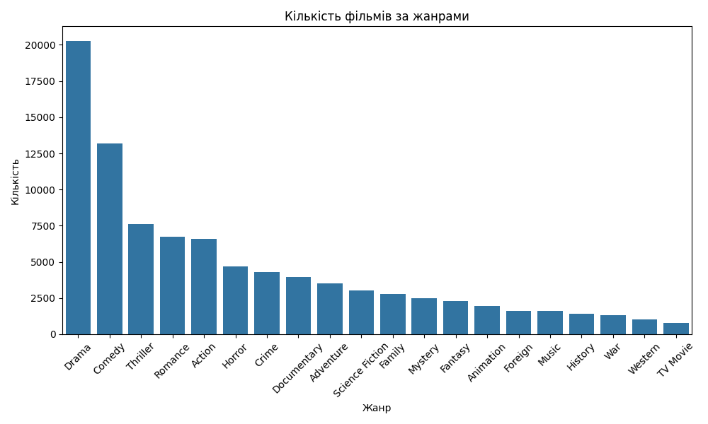

# movie_analysis

Цей проєкт виконує аналіз датасету (movies_metadata.csv) 
з інформацією про фільми. 

Мета: визначити ключові тренди, популярні жанри, зв'язок між бюджетом
та прибутком, а також дослідити зміни популярності фільмів за роками.

## Дані

Використаний датасет містить 45,466 записів і колонки.

Основні колонки:
- `title`: Назва фільму.
- `release_date`: Дата випуску.
- `genres `: Жанри фільму у форматі JSON.
- `budget`: Бюджет фільму.
- `revenue`: Прибуток фільму.
- `popularity`: Показник популярності.
- `vote_average`: Середня оцінка.

### Очищення даних
1. Розділено жанри з JSON-формату на окремі рядки.
2. Видалили записи без дат, з некоректними бюджетами та прибутками.
3. Додали нові колонки: `release_year` (рік випуску).

## Результати

### 1. Популярність жанрів
Графік нижче демонструє кількість фільмів для кожного жанру. Найпопулярніші жанри:
- **Drama**
- **Comedy**
- **Thriller**



### 2. Тренди популярності
З роками популярність фільмів ______. Це видно з графіка середньої популярності фільмів за роками:


### 3. Бюджет та прибуток
Залежність між бюджетом і прибутком показує, що високобюджетні фільми зазвичай більш ______:


Як повторити аналіз?

1. **Завантажте репозиторій**:
   ```bash
   git clone <URL-репозиторію>

2. Встановіть залежності: Переконайтеся, що у вас встановлено Python 3.8+ та бібліотеки:

bash
Копировать код
pip install pandas matplotlib seaborn

3. 


---

### **Крок 6: Додайте контактну інформацію**

Завершіть файл контактною інформацією або подякою.

```markdown
## Контакти

Якщо у вас є запитання, пишіть на email: your_email@example.com.

Дякуємо, що зацікавилися нашим проєктом!